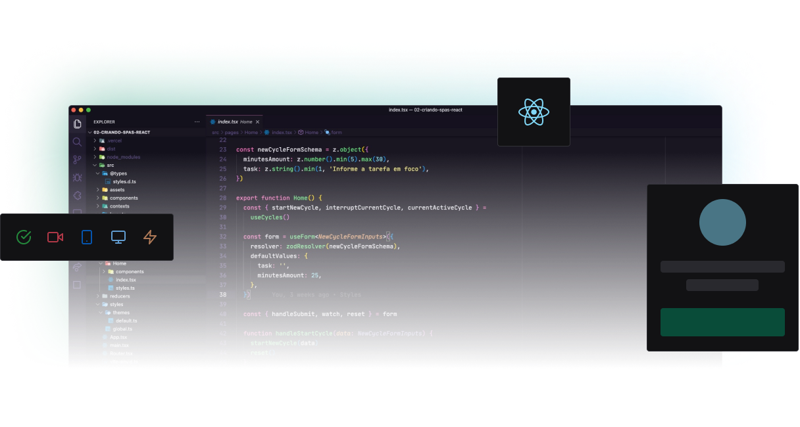

<div align="center">
  
</div>



# Event Platform

Event platform developed during Rocketseat's Ignite 2


## 🚀 About Me
I'm a full stack developer javascript...


## License

[License MIT](https://github.com/Luciano-Ferreira/event-platform/blob/main/LICENSE)


## Tech Stack


- **Graph CMS** (Content Management System)
- **Vite**
- **ReactJS**
- **Typescript**
- **[VimeJS](https://vimejs.com/getting-started/installation)** (other alternative videojs)
- **react router dom** (routing)
- **react-hook-form**
- **classnames**
- **Graphql**
- **Apollo Client**


## Installation

Install my-project with npm or yarn

```bash
  git clone https://github.com/Luciano-Ferreira/event-platform.git
  cd event-platform
  yarn
```
create .local.env similar to .local.env.example

these [keys](https://app.graphcms.com/5e6baab1676a498d87c8f6eeef36c1fe/master/settings/project) you get by creating an account on graphcms

[clone GraphCMS](https://app.graphcms.com/clone/1d7442bf5a434389904c44d54a041b01?name=Ignite%20Lab%2002)

```bash
## generate types

yarn codegen

## run app

yarn dev
```

[More notes](https://luciano-silva.notion.site/ignite-2-anota-es-476840ab5e204b1895029797c0ca8cff)

## Authors

- [@Luciano Silva](https://www.github.com/luciano-ferreira)